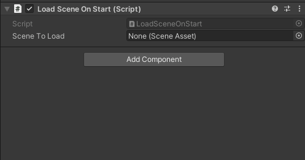
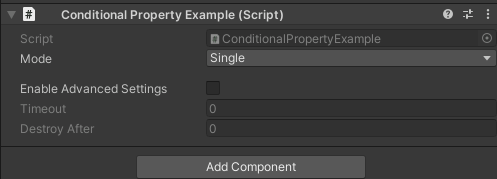
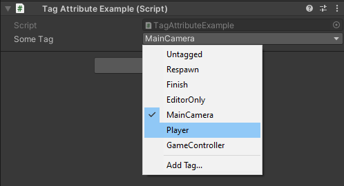

# Unity Editor Utilities

A collection of single file editor utilities for the Unity game engine.

## Content
- [Scene Reference](#scene-reference-link)
- [Conditional Attributes](#conditional-attributes-link)
- [Tag Attribute](#tag-attribute-link)

## Scene Reference ([link](DemoProject/Assets/Scripts/SceneReference.cs))

A utility type that holds a safe reference to a scene.



### Features
- Rename scenes without needing to update references
- Warns you if a selected scene is not in the build settings
- Easily add/remove scenes from build settings right in the inspector
- No runtime overhead (in builds)

### Usage

```c#
public SceneReference myScene;

private void Start() {
    myScene.Load();
    // Or
    SceneManager.Load(myScene); // Implicit cast to int (build index)
}
```

## Conditional Attributes ([link](DemoProject/Assets/Scripts/ConditionalPropertyAttributes.cs))

Attributes allowing you to hide/disable serialized fields depending on the 
values of other fields. Note that it currently only supports checking other 
fields. Property and method support might be added in the future.



### Usage

```c#
public Mode mode;

[ShowIf(nameof(mode), Mode.Random)] // Equality
public float randomWeight;

public bool enableAdvancedSettings;

[EnableIf(nameof(enableAdvancedSettings))]
public int timeout;

[EnableIf(nameof(enableAdvancedSettings), Invert = true)] // Inverted
public int inverted;
```

## Tag Attribute ([link](DemoProject/Assets/Scripts/TagAttribute.cs))

Displays a tag selection dropdown for a string field.



### Features
- Warns on missing tags (yellow tint)
- Manual string entry (right click)

### Usage
```c#
[Tag]
public string someTag;
```