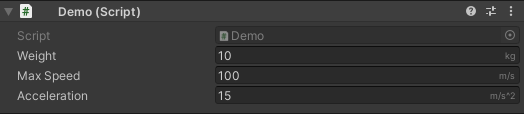

# Unity Editor Utilities

A collection of utilities for Unity.

# Content
- [Attributes](#attributes)
  - [Conditional](#conditional-link)
  - [Tag](#tag-link)
  - [Display Name](#display-name-link)
  - [Read Only](#read-only-link)
  - [Min Max Range](#min-max-range-link)
  - [Unit](#unit-link)
  - [Enum Named Array](#enum-named-array-link)
- [Other](#other)
  - [Scene Reference](#scene-reference-link)
  - [Collider Visualizer](#collider-visualizer-link)


# Attributes

## Conditional ([link](DemoProject/Assets/Scripts/ConditionalPropertyAttributes.cs))

Attributes allowing you to hide/disable serialized fields depending on the 
values of other fields. Note that it currently only supports checking other 
fields. Property and method support might be added in the future.


### Usage

```c#
public Mode mode;

[ShowIf(nameof(mode), Mode.Random)] // Equality
public float randomWeight;

public bool enableAdvancedSettings;

[EnableIf(nameof(enableAdvancedSettings))]
public int timeout;

[EnableIf(nameof(enableAdvancedSettings), Invert = true)] // Inverted
public int inverted;
```

## Tag ([link](DemoProject/Assets/Scripts/TagAttribute.cs))

Displays a tag selection dropdown for a string field.


### Features
- Warns on missing tags (yellow tint)
- Manual string entry (right click)

### Usage
```c#
[Tag]
public string someTag;
```

## Display Name ([link](DemoProject/Assets/Scripts/DisplayNameAttribute.cs))

Changes the display name of a field in the inspector.

### Usage
```csharp
[DisplayName("Other Name")]
public float someName; // Will be displayed as "Other Name" in the inspector
```

## Read Only ([link](DemoProject/Assets/Scripts/ReadOnlyAttribute.cs))

Makes a field read-only in the inspector. Useful for displaying debug information that the user is not supposed to edit.


### Usage
```csharp
[ReadOnly]
public float currentValue;
```

## Min Max Range ([link](DemoProject/Assets/Scripts/MinMaxRangeAttribute.cs))

Displays a min/max slider for a Vector2 field.


### Usage
```csharp
[MinMaxRange(0, 10)]
public Vector2 range;
```

## Unit ([link](DemoProject/Assets/Scripts/UnitAttribute.cs))

Draws a little string in the right of a number or string field in the inspector. Useful for indicating in what unit a value is.



### Usage
```csharp
[Unit("kg")]
public float weight;

[Unit("m/s")]
public float maxSpeed;

[Unit("m/s^2")]
public float acceleration;
```


## Enum Named Array ([link](DemoProject/Assets/Scripts/EnumNamedArrayAttribute.cs))

Used on an array to give its elements names from an enum.


### Usage
```csharp
[EnumNamedArray(typeof(Fruits))]
public string[] fruitIds;

public enum Fruits {
    Apple,
    Orange,
    Banana,
}
```


# Other

## Scene Reference ([link](DemoProject/Assets/Scripts/SceneReference.cs))

A utility type that holds a safe reference to a scene.


### Features
- Rename scenes without needing to update references
- Warns you if a selected scene is not in the build settings
- Easily add/remove scenes from build settings right in the inspector
- No runtime overhead (in builds)

### Usage

```c#
public SceneReference myScene;

private void Start() {
    myScene.Load();
    // Or
    SceneManager.Load(myScene); // Implicit cast to int (build index)
}
```

## Collider Visualizer ([link](DemoProject/Assets/Scripts/Editor/ColliderVisualizerWindow.cs))

A tool to vizualize all the colliders and triggers in the scene.

Found under the "Tools/Collider Vizualizer" menu.


### Features
- Displays colliders and triggers
- Makes colliders selectable
- Filtering by layer or tag

### Limitations
- Can not render convex mesh collider, it will render the normal mesh instead
- Some colliders like capsules and meshes have no fill color, and cannot be selected
